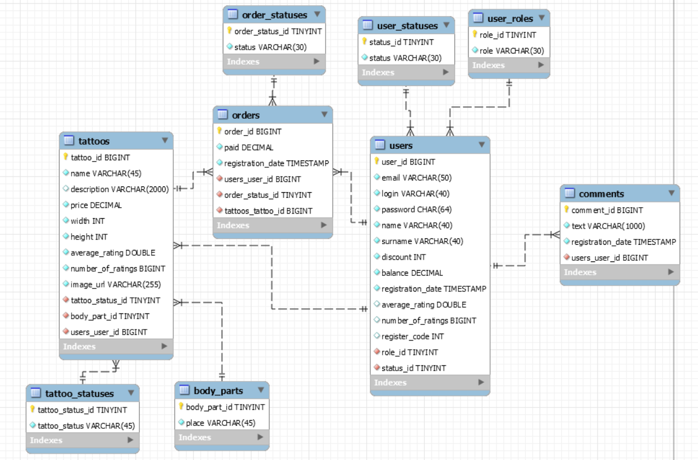

Final project for EPAM courses Java-web

# Tattoo-salon

#### Tattoo-salon is a web-service that allows users to search for and order tattoos. Also, users can influence the service by offering their tattoos and rating the already available tattoos and the work of the administration. There are 3 types of roles in the system: Guest, User, Administrator.

## Guest role
- Can view start page
- Can visit the tattoo catalog page
- Can search for tattoos in the catalog
- Can visit the "about us" page
- Can login and register
- Can change localization
## User role
- Can view start page
- Can view his profile
- Can edit his profile (name, surname, email, password)
- Can top up balance
- Can offer his tattoo to the administration
- Can visit the tattoos catalog page
- Can search for a tattoos in the catalog
- Can create and cancel orders
- Can evaluate the tattoo and evaluate the work of the administration in the completed orders
- Can view a list of their orders
- Can search for orders in the list of their orders
- Can visit the "about us" page
- Can write a comment on the "about us" page
- Can change localization
- Can log out
## Administrator role
General
- Can view start page
- Can view his profile
- Can edit his profile (name, surname, email, password)
- Can change localization
- Can log out

Tattoos
- Can visit the tattoos catalog page
- Can visit the page of all tattoos
- Can visit the blocked tattoos page
- Can visit the page of user-suggested tattoos
- Can search for a tattoos
- Can approve or block custom tattoo
- Can block and unblock already accepted tattoos
- Can give a discount to the user who offered the tattoo when considering it
- Can add a tattoo
- Can change the price of the tattoo

Users
- Can visit all users page
- Can visit the blocked users page
- Can visit the page of active users
- Can search for users
- Can block or unblock a user

Orders
- Can view a list of all orders
- Can view a list of active orders
- Can view a list of completed orders
- Can search for orders
- Can cancel orders
- Can complete orders

Comments
- Can visit the "about us" page
- Can write a comment on the "about us" page
- Can delete any user's comment

Database structure

